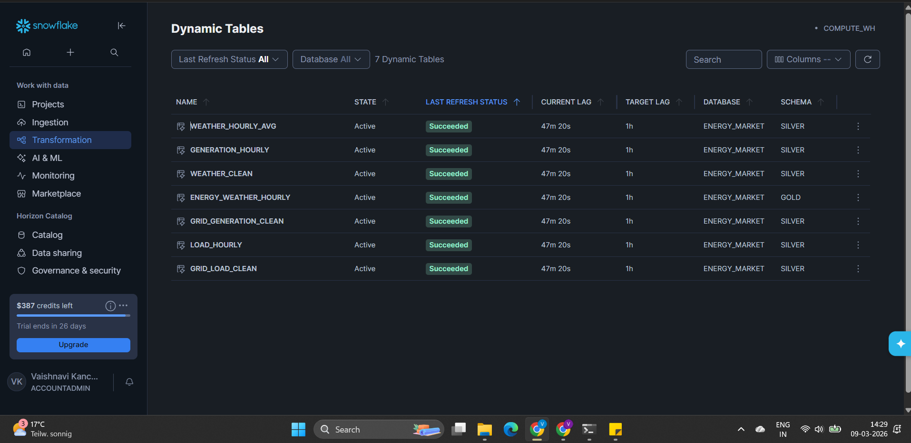
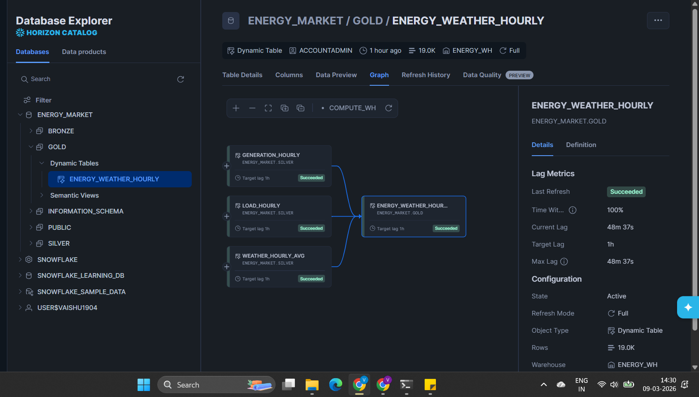
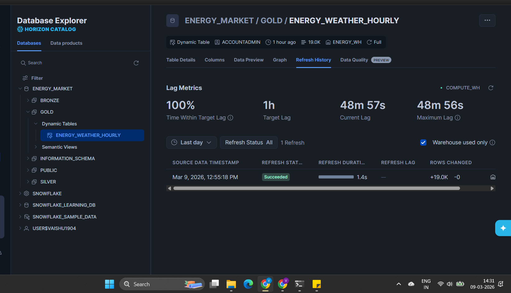
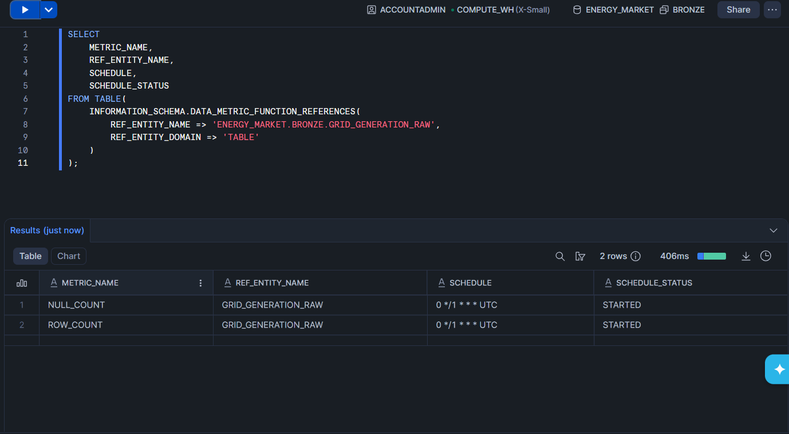
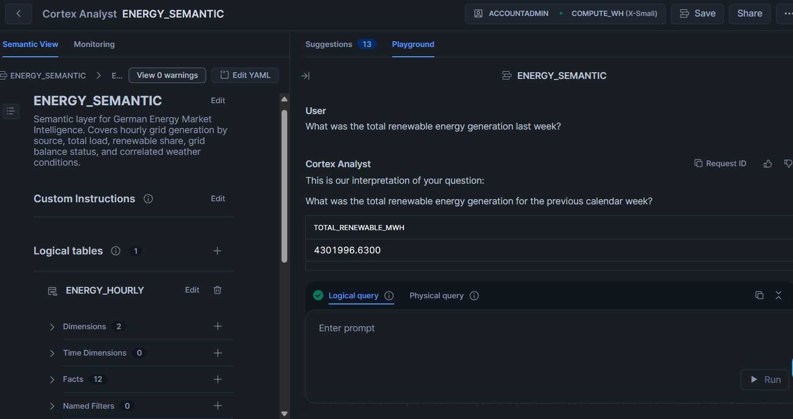
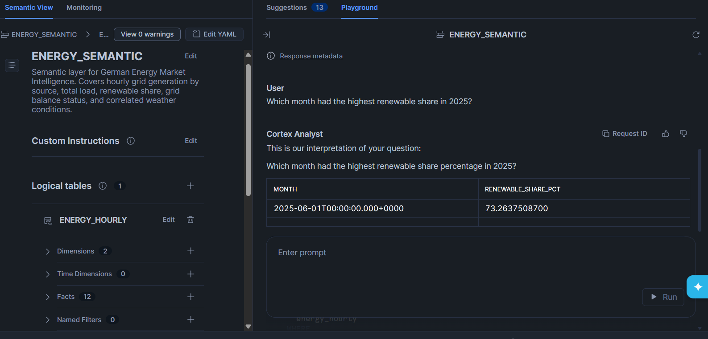
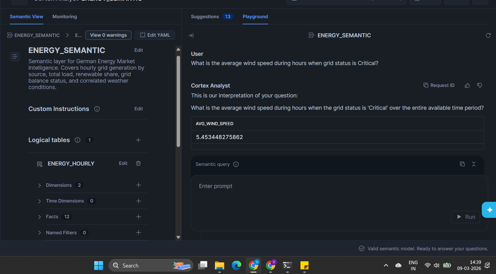
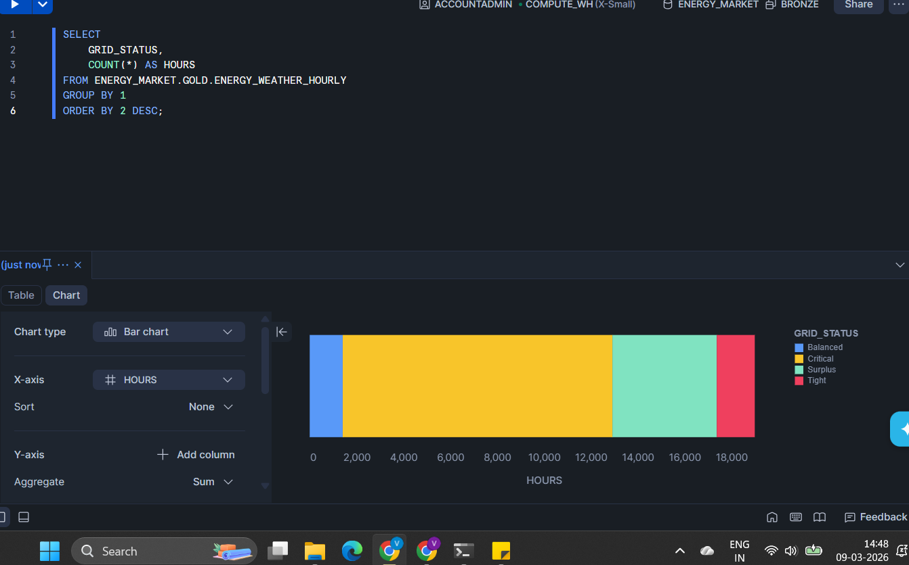
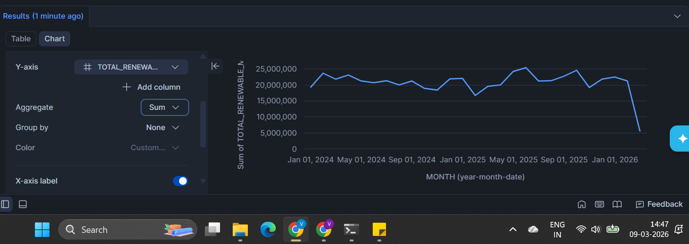

# German Energy Market Intelligence
### Snowflake-native data pipeline · Bronze → Silver → Gold · Cortex Analyst

A data engineering pipeline built on Snowflake that pulls German electricity grid data (SMARD) and weather data (Open-Meteo) into a unified hourly dataset, queryable in natural language via Cortex Analyst. Built to demonstrate Snowflake-native pipeline patterns — Dynamic Tables, Semantic Views, DMF-based DQ monitoring — without an external orchestrator.

---

## What This Demonstrates

- Multi-source API ingestion (SMARD grid data + Open-Meteo weather) via idempotent MERGE pattern
- Medallion architecture using Snowflake Dynamic Tables — no Airflow, no external orchestrator
- Native Data Quality monitoring (NULL_COUNT, ROW_COUNT) on Bronze tables via Snowflake DMFs
- Semantic View design for AI-readiness — the layer that makes Cortex Analyst accurate
- Cortex Analyst natural language querying against a governed semantic layer
- GitHub Actions as a lightweight production-pattern scheduler (hourly cron)

---

## Architecture

```
SMARD API (German grid)     Open-Meteo API (weather)
        │                           │
        ▼                           ▼
┌─────────────────────────────────────────────┐
│                   BRONZE                     │
│  GRID_GENERATION_RAW   GRID_LOAD_RAW        │
│  WEATHER_RAW           SMARD_FILTER_REF     │
│                                              │
│  DQ Monitoring: NULL_COUNT + ROW_COUNT      │
│  Schedule: hourly  Status: STARTED          │
└─────────────────────────────────────────────┘
                    │
                    ▼  Dynamic Tables (TARGET_LAG = 1h)
┌─────────────────────────────────────────────┐
│                   SILVER                     │
│  GRID_GENERATION_CLEAN  — filtered, ENERGY_CLASS label
│  GRID_LOAD_CLEAN        — filtered          │
│  WEATHER_CLEAN          — filtered          │
│  GENERATION_HOURLY      — SUM by source     │
│  LOAD_HOURLY            — MAX total load    │
│  WEATHER_HOURLY_AVG     — AVG across cities │
└─────────────────────────────────────────────┘
                    │
                    ▼  Dynamic Table (REFRESH_MODE = FULL)
┌─────────────────────────────────────────────┐
│                    GOLD                      │
│  ENERGY_WEATHER_HOURLY                      │
│  — 3-way join: generation + load + weather  │
│  — RENEWABLE_SHARE_PCT                      │
│  — GENERATION_LOAD_DELTA_MWH                │
│  — GRID_STATUS (Critical/Tight/Balanced/Surplus)
│  19,000 rows · 27 months · 1.4s refresh    │
└─────────────────────────────────────────────┘
                    │
                    ▼
┌─────────────────────────────────────────────┐
│              SEMANTIC VIEW                   │
│  ENERGY_SEMANTIC                            │
│  2 Dimensions · 12 Facts · 2 Metrics       │
│  Valid semantic model · 0 warnings          │
└─────────────────────────────────────────────┘
                    │
                    ▼
           Cortex Analyst
     Natural language → SQL → results
```





---

## Data Sources

| Source | API | Coverage | Update frequency |
|---|---|---|---|
| SMARD (Bundesnetzagentur) | smard.de/app/chart_data | Jan 2024 — present | Hourly |
| Open-Meteo | api.open-meteo.com | Mar 2026 — present | Hourly |

**SMARD filters ingested:** Wind Onshore, Wind Offshore, Photovoltaik, Biomasse, Wasserkraft, Kernenergie, Braunkohle, Steinkohle, Erdgas, Sonstige Konventionelle, Sonstige Erneuerbare, Stromverbrauch Gesamt

**Weather locations:** Berlin (52.52°N, 13.41°E), Hamburg (53.55°N, 10.00°E), München (48.14°N, 11.58°E)

---

## Pipeline

### Ingestion
`ingestion/ingest.py` runs hourly via GitHub Actions (`.github/workflows/hourly_ingest.yml`). Fetches the latest SMARD timestamp chunk and current Open-Meteo forecast, merges into Bronze using an idempotent MERGE pattern — no duplicates on reruns.

`ingestion/backfill.py` was run once to load SMARD historical data from January 2024. It fetched 209,485 generation rows and 56,985 load rows across 54 batches of 5,000.

Snowflake credentials are stored as GitHub Secrets (SF_ACCOUNT, SF_USER, SF_PASSWORD).

### Transformation
Six Silver Dynamic Tables clean and aggregate Bronze data. Three clean tables apply null filtering and range checks. Three aggregation tables pre-compute hourly summaries by energy source — this is what enables the Gold join to be a pure SELECT without embedded aggregations.

Gold joins the three Silver aggregation tables on TIMESTAMP_UTC and computes derived metrics: renewable share percentage, generation-load delta, and grid balance status classification.

### Scheduling
GitHub Actions runs the ingestion script hourly. 40 of 41 runs succeeded in the first active day. The one failure was a transient Open-Meteo connection reset at 2:45 AM — retry logic has since been added to the ingestion script.

**Why GitHub Actions over Snowflake Tasks:** Snowflake External Access Integration (required for Tasks to call external APIs) is not available on trial accounts. GitHub Actions is a legitimate production-pattern alternative for lightweight scheduled ingestion and keeps credentials out of Snowflake.

---

## Key Design Decisions

### Gold REFRESH_MODE = FULL
Gold uses `REFRESH_MODE = FULL` explicitly. Snowflake AUTO mode selects FULL for this query because LEFT JOIN combined with NULLIF and float arithmetic in the same query block prevents incremental change tracking. At current data volumes (19,000 rows, 27 months), FULL refresh completes in **1.4 seconds** and costs fractions of a credit per hour — incremental provides no operational benefit at this scale.

Production fix for larger datasets: replace LEFT JOINs with INNER JOINs after verifying referential integrity across sources, and cast derived columns to NUMBER types.



### NUMBER(18,4) over FLOAT for energy values
Bronze tables use NUMBER(18,4) for all MWH columns rather than FLOAT. Floats introduce precision issues for energy measurements and block Dynamic Table change tracking through arithmetic operations. NUMBER types are exact and support incremental refresh compatibility.

### Aggregations at Silver, not Gold
SUM, MAX, and AVG aggregations are computed in Silver Dynamic Tables (GENERATION_HOURLY, LOAD_HOURLY, WEATHER_HOURLY_AVG). Gold is a pure three-way join. This separation keeps the Gold query simple, makes each layer independently testable, and was the attempted path to enabling INCREMENTAL on Gold — ultimately blocked by the LEFT JOIN constraint above.

### DMFs on Bronze only
Snowflake Data Metric Functions cannot be set on Dynamic Tables — this is a documented platform constraint. DQ monitoring (NULL_COUNT on VALUE_MWH, ROW_COUNT) applies to Bronze tables only, where raw data lands before transformation.



---

## Data Coverage

```sql
SELECT DATE_TRUNC('MONTH', TIMESTAMP_UTC) AS MONTH, COUNT(*) AS ROW_COUNT
FROM ENERGY_MARKET.GOLD.ENERGY_WEATHER_HOURLY
GROUP BY 1 ORDER BY 1;
-- Returns 27 rows: 2024-01 through 2026-03
```

27 consecutive months, no gaps. Row counts align with expected hourly resolution per month (720-744 rows for full months, 203 for partial March 2026).

---

## Cortex Analyst — Natural Language Query Results

Queries run against `ENERGY_MARKET.GOLD.ENERGY_SEMANTIC` (2 Dimensions, 12 Facts, 2 Metrics, 0 warnings).

| Question | Result |
|---|---|
| Total renewable generation last week | 4,301,996.63 MWH |
| Highest renewable share month in 2025 | June 2025 — 73.26% |
| Avg wind speed during Critical grid hours | 5.45 m/s |







Grid status distribution across 19,000 hours (Jan 2024 — Mar 2026): Surplus dominates, Critical hours are a measurable minority.





---

## Known Limitations

**Weather data coverage:** Open-Meteo free tier is limited to 92 days historical. Weather data is available from March 2026 only. Gold rows before March 2026 have NULL weather columns — this is expected and does not affect grid generation or load analysis.

**Weather as national proxy:** Weather observations are averaged across Berlin, Hamburg, and München. SMARD grid data is a national German aggregate. Weather-energy correlations reflect national trends, not precise causal relationships at regional level.

**SMARD backfill scope:** SMARD data is available from 2014. Backfill was scoped to January 2024 for practicality. Kernenergie (nuclear) has sparse data from April 2023 onward — Germany completed its nuclear exit in April 2023.

**Trial account constraints:** Built on a Snowflake Enterprise trial (AWS EU Frankfurt). External Access Integration is not available on trial, which is why Snowflake Tasks are not used for ingestion. Cortex Agents require cross-region inference which is also blocked on trial. These are account-tier limitations, not architectural ones.

**Not fault-tolerant:** Single account, no disaster recovery, no alerting on pipeline failures beyond GitHub Actions email notifications. Built to demonstrate Snowflake-native pipeline patterns, not for production resilience.

---

## Repository Structure

```
├── .github/
│   └── workflows/
│       └── hourly_ingest.yml       # GitHub Actions hourly cron
├── ingestion/
│   ├── ingest.py                   # Hourly production ingestion script
│   └── backfill.py                 # One-time historical SMARD backfill
├── snowflake/
│   ├── setup.sql                   # DB, schemas, warehouse, Bronze tables
│   ├── silver.sql                  # Silver Dynamic Tables (6 tables)
│   ├── gold.sql                    # Gold Dynamic Table with design comments
│   ├── data_monitoring.sql         # DMF setup on Bronze tables
│   └── semantic.sql                # Semantic View definition
├── requirements.txt
└── README.md
```

---

## Stack

Snowflake · Dynamic Tables · Cortex Analyst · Semantic Views · Data Metric Functions · GitHub Actions · Python · SMARD API · Open-Meteo API
